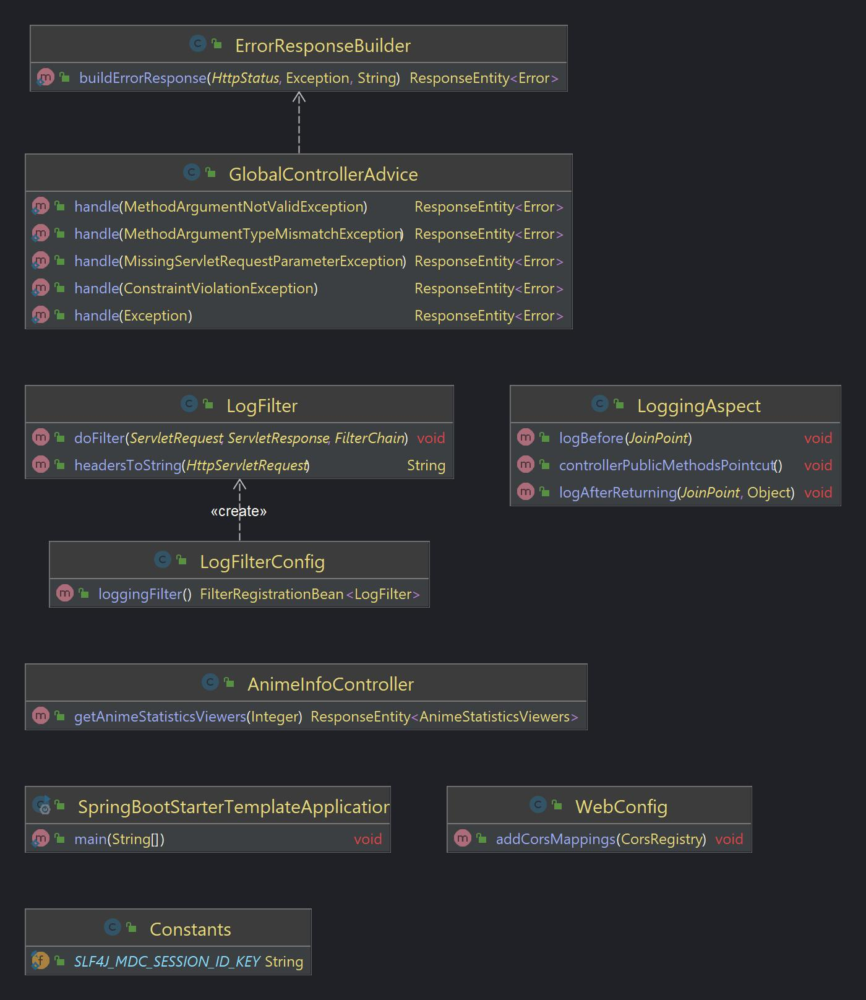

# Spring Boot Starter Template
_by [PollitoDev](https://pollitodev.netlify.app/)_

## Purpose

Starting point for future projects, designed to embrace Component-Driven Development (CDD) practices. It encapsulates essential dependencies and best-practice boilerplates.

## Classes role and explanation

### dev.pollito.springbootstartertemplate.aspect.LoggingAspect

Centralized logging logic across the application, particularly for controller methods.

#### [RECOMENDED PRACTICE] Log APIs args and return values

If your application has client APIs, I highly recommend also logging the @Before and @AfterReturning of those API methods.

Example: Let's imagine there's a com.weatherstack.api package which contains interfaces related to getting the weather. Then I would edit the LoggingAspect file as follows:

```java
@Aspect
@Component
@Slf4j
public class LoggingAspect {

  @Pointcut("execution(* com.weatherstack.api.*.*(..))")
  public void weatherstackApiMethodsPointcut() {}

  @Pointcut("execution(public * dev.pollito.springbootstartertemplate.controller..*.*(..))")
  public void controllerPublicMethodsPointcut() {}

  @Before("weatherstackApiMethodsPointcut() || controllerPublicMethodsPointcut()")
  public void logBefore(JoinPoint joinPoint) {
    log.info(
        "["
            + joinPoint.getSignature().toShortString()
            + "] Args: "
            + Arrays.toString(joinPoint.getArgs()));
  }

  @AfterReturning(
      pointcut = "weatherstackApiMethodsPointcut() || controllerPublicMethodsPointcut()",
      returning = "result")
  public void logAfterReturning(JoinPoint joinPoint, Object result) {
    log.info("[" + joinPoint.getSignature().toShortString() + "] Response: " + result);
  }
}
```

Changes made:

- Creating a new @Pointcut, whose excecution value is the package containing the API interfaces
- Adding the recently created pointcut to the @Before and @AfterReturning annotated methods.

Do this process to every package you consider is worth logging its public methods arguments and results.

### dev.pollito.springbootstartertemplate.config.LogFilterConfig

Configuration class in a Spring Boot application, dedicated to setting up a custom filter, specifically dev.pollito.springbootstartertemplate.filter.**LogFilter**.

By default, it ensures that LogFilter is applied globally to all requests.

### dev.pollito.springbootstartertemplate.config.WebConfig

Configuration class focusing on Cross-Origin Resource Sharing (CORS) settings.

By default, it allows cross-origin requests from any source, which is good for dev purposes. However this might not be suitable for a production environment.

### dev.pollito.springbootstartertemplate.controller.PetsController

Controller that serves as an example of how to implement a generated interface. Just for demonstration purposes. It calls the default methods within implemented interface. 


### dev.pollito.springbootstartertemplate.controller.advice.GlobalControllerAdvice

Global exception handler designed to catch and handle various exceptions that may occur during the processing of web requests.

By default, it handles:

- MissingServletRequestParameterException: Caught when required request parameters are missing.
- ConstraintViolationException: Handled when Bean Validation API constraint violations occur.
- MethodArgumentTypeMismatchException: Caught when a method argument is not the expected type.
- MethodArgumentNotValidException: Handled when an argument annotated with @Valid fails validation.
- Exception: A generic catch-all for any other exceptions not explicitly handled by the other methods.

Each handler method returns a ResponseEntity<Error>, where Error is meant to be a custom object created in your provider OAS yaml file.

By default also contains the annotation @Order() empty with no args. This means that the advice runs last in relation to other @ControllerAdvice components.

### dev.pollito.springbootstartertemplate.filter.LogFilter

It implements a servlet filter for logging request and response details.

- It initializes the Mapped Diagnostic Context (MDC) with a unique session ID for each request, facilitating easier tracing of logs related to specific requests.
- It logs details about the incoming request, including its method, URI, query string, and headers.
- After the request has been processed, it also logs the response status.

### dev.pollito.springbootstartertemplate.util.Constants

Container for application-wide constants.

By default it only contains the constant SLF4J_MDC_SESSION_ID_KEY, used in **LogFilter** as a key in the SLF4J Mapped Diagnostic Context (MDC) for storing and retrieving a unique session identifier.

Feel free to add all your needed constants here.

### dev.pollito.springbootstartertemplate.util.ControllerAdviceUtil 

Utility for handling exceptions and constructing error responses.

Feel free to add all your error responses construction logic here. Example: Let's imagine we need to build a response for a InvalidBase64ImageException. That would look something like this:

```java
public class ControllerAdviceUtil {
    //others methods
    //...
    
    public static ResponseEntity<Error> getBadRequestError(InvalidBase64ImageException e) {
        return buildErrorResponse(
                HttpStatus.BAD_REQUEST, e, "image provided is not a valid Base64Image");
    }
}

```

You could also create another utility class to separate error responses construction logic.

### dev.pollito.springbootstartertemplate.SpringBootStarterTemplateApplication

Default entry point to a Spring Boot application.

## Resources > openapi files

This is a totally arbitrary folder inside resources where I decided is good enough to put all the OAS.yaml files.

Here you are expected to have:

- Zero or more OAS.yaml files that do the role of being the "clients contract".
- At least one OAS.yaml file that does the role of being the "provider contract".
  - Usually when talking about microservices, a microservice do only one thing, so it should provide only one contract.
  - Each contract should have an Error schema, which after generation tasks, will be used by @RestControllerAdvice annotated classes and their respective utilities classes for for constructing standardized error responses.

Here is my recommended Error schema, and the one being used in this template

```yaml
Error:
  type: object
  properties:
    timestamp:
      type: string
      description: The date and time when the error occurred in ISO 8601 format.
      format: date-time
      example: "2024-01-04T15:30:00Z"
    session:
      type: string
      format: uuid
      description: A unique UUID for the session instance where the error happened, useful for tracking and debugging purposes.
    error:
      type: string
      description: A brief error message or identifier.
    message:
      type: string
      description: A detailed error message.
    path:
      type: string
      description: The path that resulted in the error.
```
Feel free to organize files in subfolders if necessary. Don't forget to maintain consistency with the pom.xml org.openapitools:openapi-generator-maven-plugin plugin.

## Resources > logback.xml

Configuration to log information to the console, with a customized pattern that includes a session ID for better traceability of log entries.

## pom.xml

- This template uses [Spring Boot 3.2.3](https://github.com/spring-projects/spring-boot/releases/tag/v3.2.3) and Java 21
- Basic dependencies: you'll find these in almost every Spring Boot 3 application out there:
  - [org.springframework.boot » spring-boot-starter-web » 3.2.3](https://mvnrepository.com/artifact/org.springframework.boot/spring-boot-starter-web/3.2.3): essential for building web applications using Spring Boot
  - [org.springframework.boot » spring-boot-devtools » 3.2.3](https://mvnrepository.com/artifact/org.springframework.boot/spring-boot-devtools/3.2.3): set of tools that make the development process with Spring Boot more efficient.
  - [org.springframework.boot » spring-boot-configuration-processor » 3.2.3](https://mvnrepository.com/artifact/org.springframework.boot/spring-boot-configuration-processor/3.2.3): generates metadata for configuration properties, making them easier to work with in IDEs.
  - [org.projectlombok » lombok » 1.18.30](https://mvnrepository.com/artifact/org.projectlombok/lombok/1.18.30): reduces boilerplate code like getters, setters, and constructors through annotations.
  - [org.springframework.boot » spring-boot-starter-test » 3.2.3](https://mvnrepository.com/artifact/org.springframework.boot/spring-boot-starter-test/3.2.3): includes support for JUnit, Spring Test & Spring Boot Test, AssertJ, Hamcrest, and a bunch of other libraries necessary for thorough testing.
- Dependencies required by [org.openapitools » openapi-generator-maven-plugin » 7.4.0](https://mvnrepository.com/artifact/org.openapitools/openapi-generator-maven-plugin/7.4.0) when generating provider code:
  - [io.swagger.core.v3 » swagger-core-jakarta » 2.2.20](https://mvnrepository.com/artifact/io.swagger.core.v3/swagger-core-jakarta/2.2.20): solves error package io.swagger.v3.oas.annotations does not exist.
  - [org.openapitools » jackson-databind-nullable » 0.2.6](https://mvnrepository.com/artifact/org.openapitools/jackson-databind-nullable/0.2.6): solves error package org.openapitools.jackson.nullable does not exist.
  - [org.springframework.boot » spring-boot-starter-validation » 3.2.3](https://mvnrepository.com/artifact/org.springframework.boot/spring-boot-starter-validation/3.2.3): solves validations being ignored.
- Dependency required by AOP practices:
  - [org.aspectj » aspectjweaver » 1.9.21.2](https://mvnrepository.com/artifact/org.aspectj/aspectjweaver/1.9.21.2): modifies Java classes to weave in the aspects.
- Plugins:
  - [org.springframework.boot » spring-boot-maven-plugin » 3.2.3](https://mvnrepository.com/artifact/org.springframework.boot/spring-boot-maven-plugin/3.2.3) : used for explicitly excluding lombok from the final packaged application, since Lombok is a compile-time only tool that helps reduce boilerplate code.
  - [com.spotify.fmt » fmt-maven-plugin » 2.23](https://mvnrepository.com/artifact/com.spotify.fmt/fmt-maven-plugin/2.23): formats your Java source code to comply with Google Java Format.
  - [org.openapitools » openapi-generator-maven-plugin » 7.4.0](https://mvnrepository.com/artifact/org.openapitools/openapi-generator-maven-plugin/7.4.0): a Maven plugin to support the OpenAPI generator project. Is a code generator that embraces CDD practices. By default it's configured like this:

```xml
<plugin>
  <groupId>org.openapitools</groupId>
  <artifactId>openapi-generator-maven-plugin</artifactId>
  <version>7.2.0</version>
  <executions>
    <execution>
      <id>provider generation: petstore.yaml</id>
      <goals>
        <goal>generate</goal>
      </goals>
      <configuration>
        <inputSpec>${project.basedir}/src/main/resources/openapi/petstore.yaml</inputSpec>
        <generatorName>spring</generatorName>
        <output>${project.build.directory}/generated-sources/openapi/</output>
        <apiPackage>io.swagger.petstore.api</apiPackage>
        <modelPackage>io.swagger.petstore.models</modelPackage>
        <configOptions>
          <interfaceOnly>true</interfaceOnly>
          <useSpringBoot3>true</useSpringBoot3>
          <useEnumCaseInsensitive>true</useEnumCaseInsensitive>
        </configOptions>
      </configuration>
    </execution>
  </executions>
</plugin>
```

Let's check what's going on here.

- Group ID and Artifact ID: identifies the OpenAPI Generator plugin itself.
- Version: specifies the version of the OpenAPI Generator plugin.
- Execution block: defines when and how the plugin's goal(s) should be executed within the build lifecycle.
  - ID: a unique identifier for this execution instance.
  - Goals: specifies the generate goal, which tells the plugin to perform code generation.
  - Configuration Block: provides detailed instructions on how the code generation should be performed.
    - inputSpec: points to the location of the OpenAPI spec file that does the role of being the provider contract. In this case, petstore.yaml located under src/main/resources/openapi/ .
    - generatorName: specifies the spring generator, indicating that the code should be generated with Spring in mind, tailoring the output for Spring-based projects.
    - output: the directory where the generated code should be placed. Personally I think target/generated-sources/openapi/ directory is a good place.
    - apiPackage and modelPackage: define the Java package names for the generated API interfaces and model classes, respectively. These values are up to you. Personally I like to use the OAS file server url in reverse url notation. In case that info is not available, using the project groupId + artifactId is common practice
    - configOptions: a set of additional configuration options.
      - interfaceOnly: it set to true. You will need to create your own implementation anyways.
      - useSpringBoot3: ensures compatibility with Spring Boot 3.
      - useEnumCaseInsensitive: if there are generated enums, it is configured to be case-insensitive, adding flexibility to how their values are deserialized.

## UML diagram



## How to run

1. maven clean + maven compile. This will generate the code in target/generated-sources/openapi/
2. run the application
3. execute this curl to check that everything is working

```shell
curl --location 'http://localhost:8080/pets'
```

Should get the default response from the interface, an empty body with status 501.

You can also see that in the console:

```log
2024-03-14 21:25:23 INFO  d.p.s.filter.LogFilter [SessionID: 373c02ac-10e3-44b1-9a9b-dc35f807a0ab] - >>>> Method: GET; URI: /pets; QueryString: null; Headers: {user-agent: PostmanRuntime/7.37.0, accept: */*, cache-control: no-cache, postman-token: 7a238d8f-d26e-4e84-8b5d-87bc20e54557, host: localhost:8080, accept-encoding: gzip, deflate, br, connection: keep-alive}
2024-03-14 21:25:23 INFO  d.p.s.aspect.LoggingAspect [SessionID: 373c02ac-10e3-44b1-9a9b-dc35f807a0ab] - [PetsController.findPets(..)] Args: [null, null]
2024-03-14 21:25:23 INFO  d.p.s.aspect.LoggingAspect [SessionID: 373c02ac-10e3-44b1-9a9b-dc35f807a0ab] - [PetsController.findPets(..)] Response: <501 NOT_IMPLEMENTED Not Implemented,[]>
2024-03-14 21:25:23 INFO  d.p.s.filter.LogFilter [SessionID: 373c02ac-10e3-44b1-9a9b-dc35f807a0ab] - <<<< Response Status: 501
```

## How to add clients

### Add dependencies needed for client generation

These dependencies are:

- [javax.annotation » javax.annotation-api » 1.3.2](https://mvnrepository.com/artifact/javax.annotation/javax.annotation-api/1.3.2): solves error package javax.annotation does not exist.
- [io.github.openfeign » feign-okhttp » 13.2.1](https://mvnrepository.com/artifact/io.github.openfeign/feign-okhttp/13.2.1): solves error package feign.okhttp does not exist.
- [org.springframework.cloud » spring-cloud-starter-openfeign » 4.1.0](https://mvnrepository.com/artifact/org.springframework.cloud/spring-cloud-starter-openfeign/4.1.0): solves error package feign.form does not exist.
- [io.github.openfeign » feign-jackson » 13.2.1](https://mvnrepository.com/artifact/io.github.openfeign/feign-jackson/13.2.1): solves error package feign.jackson does not exist.
- [com.google.code.findbugs » jsr305 » 3.0.2](https://mvnrepository.com/artifact/com.google.code.findbugs/jsr305/3.0.2): solves error cannot find symbol @javax.annotation.Nullable.
- [org.junit.jupiter » junit-jupiter-api » 5.10.2](https://mvnrepository.com/artifact/org.junit.jupiter/junit-jupiter-api/5.10.2): solves error package org.junit.jupiter.api does not exist.

Additionally, you will need to create configurations for the generated client interfaces. To do that, these dependencies are needed:

- [io.github.openfeign » feign-gson » 13.2.1](https://mvnrepository.com/artifact/io.github.openfeign/feign-gson/13.2.1): solves error Cannot resolve symbol 'GsonEncoder'.

### Generate the client interface(s)

1. Add OAS.yaml client contract(s) in resources/openapi
2. For each contract, add an execution in openapi-generator-maven-plugin.

Example: imagine we have a jikan.yaml file (based on [jikan.json](https://raw.githubusercontent.com/jikan-me/jikan-rest/master/storage/api-docs/api-docs.json) )in resources/openapi, a client contract OAS that fetches information about anime.

In the pom.xml, we edit the openapi-generator-maven-plugin as follows:

```xml
<plugin>
  <groupId>org.openapitools</groupId>
  <artifactId>openapi-generator-maven-plugin</artifactId>
  <version>7.2.0</version>
  <executions>
    <execution>
      <id>provider generation: animeinfo.yaml</id>
      <goals>
        <goal>generate</goal>
      </goals>
      <configuration>
        <inputSpec>${project.basedir}/src/main/resources/openapi/animeinfo.yaml</inputSpec>
        <generatorName>spring</generatorName>
        <output>${project.build.directory}/generated-sources/openapi/</output>
        <apiPackage>dev.pollito.springbootstartertemplate.api</apiPackage>
        <modelPackage>dev.pollito.springbootstartertemplate.models</modelPackage>
        <configOptions>
          <interfaceOnly>true</interfaceOnly>
          <useSpringBoot3>true</useSpringBoot3>
          <useEnumCaseInsensitive>true</useEnumCaseInsensitive>
        </configOptions>
      </configuration>
    </execution>
    <execution>
      <id>client generation: jikan</id>
      <goals>
        <goal>generate</goal>
      </goals>
      <configuration>
        <inputSpec>${project.basedir}/src/main/resources/openapi/jikan.yaml</inputSpec>
        <generatorName>java</generatorName>
        <library>feign</library>
        <output>${project.build.directory}/generated-sources/openapi/</output>
        <apiPackage>moe.jikan.api</apiPackage>
        <modelPackage>moe.jikan.models</modelPackage>
        <configOptions>
          <feignClient>true</feignClient>
          <interfaceOnly>true</interfaceOnly>
          <useEnumCaseInsensitive>true</useEnumCaseInsensitive>
        </configOptions>
      </configuration>
    </execution>
  </executions>
</plugin>
```

What differences are between an provider generation execution and a client generation execution?

| Aspect            | Provider Generation (`petstore.yaml`) | Client Generation (`jikan.yaml`)                                                                                                                                               |
|-------------------|----------------------------------------|--------------------------------------------------------------------------------------------------------------------------------------------------------------------------------|
| **Purpose**       | Generate server-side code (API provider) for the petstore API. | Generate client-side code to interact with the jikan API.                                                                                                                      |
| **Generator Name**| `spring` (optimized for Spring Boot)   | `java` (generic Java code generation)                                                                                                                                          |
| **Library**       | N/A (not specified as it's inherently for Spring) | `feign` (uses Feign library for HTTP requests)                                                                                                                                 |
| **Output Packages**| API: `io.swagger.petstore.api`<br>Models: `io.swagger.petstore.models` | API: `moe.jikan.api`<br>Models: `moe.jikan.models`                                                                                                                             |
| **Special Configurations**| - `interfaceOnly`: Generates only interfaces.<br>- `useSpringBoot3`: Optimized for Spring Boot 3.<br>- `useEnumCaseInsensitive`: Case-insensitive enum deserialization. | - `interfaceOnly`: Generates only interfaces.<br>-`feignClient`: Generated interfaces are Feign clients.<br>- `useEnumCaseInsensitive`: Case-insensitive enum deserialization. |

There are no limits in how many clients can be generated. Each client requires its own execution block.

Run a compile to generate the new files related to the client(s) execution.

### Create a new exception

Create an exception for each client your application do requests to.

The exception can have as many fields as you want, but at minimal, needs to have the Error generated by the client OAS.

```java
@RequiredArgsConstructor
@Getter
public class JikanException extends RuntimeException {
  private final transient Error error;
}
```
Be careful from where the Error class is being imported, by now you may probably have two or more generated classes named Error.

### Handle the new created exception

You can use the already existing **GlobalControllerAdvice**, or create a new one specifically for the controller that eventually calls down the API client interface that can throw an error.

Here, I'll create a new @RestControllerAdvice as an exercise.

Here you can handle your errors as you need. This is an example of how I do it in this scenario: I will return 404 NOT FOUND when anime is not found, 500 INTERNAL SERVER ERROR under any other circumstances.

```java
@RestControllerAdvice(assignableTypes = AnimeInfoController.class)
public class AnimeControllerAdvice {

  @ExceptionHandler(JikanException.class)
  public static ResponseEntity<Error> handle(JikanException e) {
    if (isNotFound(e)) {
      return buildErrorResponse(HttpStatus.NOT_FOUND, e, e.getError().getMessage());
    }

    return buildErrorResponse(HttpStatus.INTERNAL_SERVER_ERROR, e, e.getError().getMessage());
  }

  private static boolean isNotFound(JikanException e) {
    return Objects.nonNull(e.getError().getStatus())
        && e.getError().getStatus() == HttpStatus.NOT_FOUND.value();
  }
}
```
### Create an Error Decoder that will throw the error

This is a very basic and standard error decoder, nothing fancy going on here

```java
public class JikanErrorDecoder implements ErrorDecoder {
  @Override
  public Exception decode(String s, Response response) {
    try (InputStream body = response.body().asInputStream()) {
      return new JikanException(new ObjectMapper().readValue(body, Error.class));
    } catch (IOException e) {
      return new Default().decode(s, response);
    }
  }
}
```

### Create the corresponding URL value in resources -> application.yml

By default, the generated interface will use the URL in the OAS server section. Usually in many scenarios, that value doesn't exist, is a mock URL, or it works but is pointing to a development or testing URL.

Defining a client URL in application.yml (or any external configuration file) rather than hardcoding it as a constant in your code, is a common best practice for several reasons:

- Environment Flexibility: In real-world applications, you often have different environments such as development, testing, staging, and production. Each of these environments might require different configurations, including different client URLs. Externalizing these values to a configuration file like application.yml makes it easy to change them per environment without changing the codebase.
- Ease of Maintenance: When a value is likely to change over time, keeping it in a configuration file means you can update it without having to recompile your code. This is especially useful for URLs, which can change due to new deployments, service migrations, or domain changes.
- Security: Hardcoding sensitive information, like URLs to internal systems or services, in the source code can pose a security risk, especially if the code is stored in a public or shared repository. Keeping such information in external configuration files helps in securing sensitive data, especially when combined with configuration management tools that support encryption of such properties.
- Separation of Concerns: By keeping configuration separate from code, you maintain a clear separation of concerns. Code defines behavior, while configuration specifies the environment-specific parameters. This adheres to the principles of Twelve-Factor App methodology, enhancing modularity and maintainability.
- Dynamic Configuration: Using external configurations allows for dynamic changes without the need for a new deployment. Some frameworks and platforms support refreshing configuration properties on the fly, which can be incredibly useful for feature toggles, adjusting log levels, or updating URLs without downtime.
- Collaboration and Accessibility: Developers, operations teams, and sometimes even automated deployment tools might need access to these configurations to adjust application behavior in different environments. Having them externalized in application.yml makes this process more accessible and collaborative.

For our example, the application.yml URL definition would look something like this:
```yaml
jikan:
  baseUrl: https://api.jikan.moe/v4
```

### Create a @Configuration @ConfigurationProperties class

This class reads values from application.yml. Here is an implementation example.

```java
@Configuration
@ConfigurationProperties(prefix = "jikan")
@Data
@FieldDefaults(level = AccessLevel.PRIVATE)
public class JikanProperties {
  String baseUrl;
}
```

### Create an ApiConfig class

This class configures a Feign client for interacting with the generated client API service, complete with custom serialization, deserialization, logging, and error handling.

Here is an implementation example:

```java
@Configuration
@ComponentScans(
        value = {
                @ComponentScan(
                        basePackages = {
                                "moe.jikan.api",
                        })
        })
@RequiredArgsConstructor
public class AnimeApiConfig {

  private final JikanProperties jikanProperties;

  @Bean
  public AnimeApi jikanApi() {
    return Feign.builder()
            .client(new OkHttpClient())
            .encoder(new GsonEncoder())
            .decoder(new GsonDecoder())
            .errorDecoder(new JikanErrorDecoder())
            .logger(new Slf4jLogger(AnimeApi.class))
            .logLevel(Logger.Level.FULL)
            .target(AnimeApi.class, jikanProperties.getBaseUrl());
  }
}
```
### Create a service that glue everything together

This is just business logic to showoff that everything is working. The idea here is controller -> service -> api client and back.

We are in need of a service. Let's create a very simple one.


